<h1 align="center">Hey  I'm MD Abdul Wahid Ekram</h1>
<h3 align="center">AI & Machine Learning Engineer | Python Developer</h3>

  

## 📌 About Me
- 🌱 I'm currently learning advanced deep learning, MLOps, and cloud deployment
- 👯 I'm looking to collaborate on AI/ML and open-source projects
- 🤝 I'm looking for help with scaling ML models and production deployment
- 💡 I'm passionate about building AI solutions for real-world problems
- 🚀 I love combining machine learning with full-stack development

## 🧠 My Focus Areas
- AI/ML Development
- Data Science & Analytics
- Web Development
- Open Source Contribution
- Cloud & MLOps

## 📊 GitHub Stats & Trophies

  
  

  

## 🛠️ Languages & Tools

> ## Programming Languages

> ## Frontend

> ## Backend

> ## Database

> ## DevOps & Cloud

> ## 🤖 AI Tools & Assistants

> ## Tools

  

## 🔗 Connect with Me

## 💬 Quote
> Turning data into intelligent solutions that solve real-world problems

<picture>
  <source media="(prefers-color-scheme: dark)" srcset="https://raw.githubusercontent.com/tobiasmeyhoefer/tobiasmeyhoefer/output/github-snake-dark.svg" />
  
</picture>

---

  

